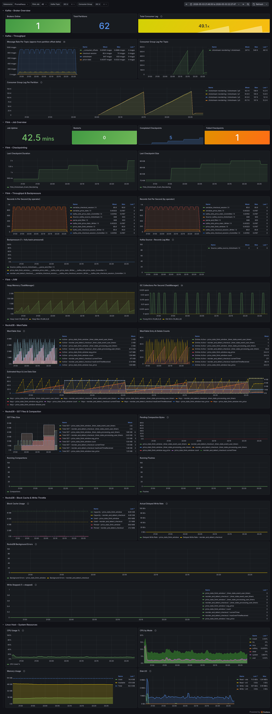
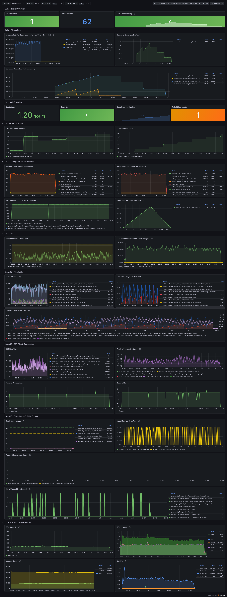
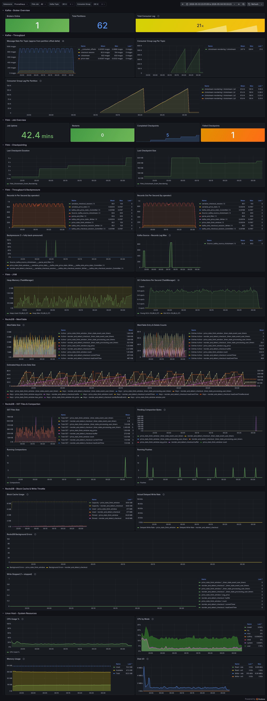

# Flink Clickstream Event Reordering

A Apache Flink 2.2 streaming application that reads clickstream events from Kafka, tolerates up to 5 minutes of out-of-order delivery, emits a `CheckoutSession` record whenever a qualifying checkout sequence is detected, and aggregates checkout prices over 5-minute processing-time tumbling windows using RocksDB's native MergeOperator for high-throughput state updates.

---

## Table of Contents

- [Problem Statement](#problem-statement)
- [Architecture](#architecture)
- [Event Schemas](#event-schemas)
- [Processing Logic](#processing-logic)
- [Reordering Processor Modes](#reordering-processor-modes)
- [RocksDB Configuration](#rocksdb-configuration)
- [Price Aggregation — RocksDB MergeOperator Design](#price-aggregation--rocksdb-mergeoperator-design)
- [Project Structure](#project-structure)
- [Prerequisites](#prerequisites)
- [Building](#building)
- [Running Locally](#running-locally)
- [Configuration](#configuration)
- [Further Reading](#further-reading)

---

## Problem Statement

An e-commerce platform produces clickstream events for each user action (page views, add-to-cart, checkout, etc.). Events are keyed by `(user_id, session_id)` and may arrive at the processing layer **up to 5 minutes late** relative to their true event time.

The goal is to detect the **last ≤ 5 events leading up to a `Checkout` event**, where the entire sequence falls within a **1-minute event-time window**, and emit a structured `CheckoutSession` record for downstream analytics.

Key constraints:

| Constraint | Value |
|---|---|
| Maximum out-of-order delay | 5 minutes |
| Checkout detection window | 1 minute (event-time) |
| Sequence length | Last ≤ 5 events before Checkout |
| Output latency target | As soon as the window is provably settled |

---

## Architecture

```
┌──────────────────────────────────────────────────────────────────┐
│  Kafka topic: clickstream                                        │
│  (JSON, keyed by user_id + "_" + session_id)                    │
└───────────────────────────┬──────────────────────────────────────┘
                            │ KafkaSource (SimpleStringSchema)
                            ▼
                   ClickStreamParser
                   (FlatMapFunction)
                   • Parse JSON → ClickStream POJO
                   • Extract optional properties.price
                   • Drop records with missing/invalid fields
                            │
                            ▼
              .keyBy(userId + "_" + sessionId)
                            │
                            ▼
              ClickStreamReorder*
              (KeyedProcessFunction — one of three modes,
               selected via --processor flag)
              • Sorted per-key event buffer
              • Part 1: event-time flush when span > 6 min
              • Part 2: wall-clock idle flush after 5 min
              • Copies price from Checkout event into session
              • Emits CheckoutSession on detection
                            │
               ┌────────────┴────────────┐
               │                         │
               ▼                         ▼
  CheckoutSessionSerializer    .keyBy(_ → "global")
  • Serialize → JSON                     │
               │               PriceStatsWindowFunction
               │               (KeyedProcessFunction)
               │               • 5-min processing-time window
               │               • ReducingState → min, max price
               │                 (RocksDBReducingMergeState)
               │               • AggregatingState → avg price
               │                 (RocksDBAggregatingMergeState)
               │               • Emits PriceStats at window end
               │                         │
               │               PriceStatsSerializer
               │               • Serialize → JSON
               │                         │
  KafkaSink (idempotent)      KafkaSink (idempotent)
               │                         │
               ▼                         ▼
┌──────────────────────┐   ┌─────────────────────────────────┐
│  checkout-session    │   │  price-stats                    │
│  (CheckoutSession    │   │  (PriceStats per 5-min window)  │
│   JSON records)      │   └─────────────────────────────────┘
└──────────────────────┘
```

The local development stack (managed by `podman-compose`) adds:

- **Apache Kafka** (KRaft mode, no Zookeeper) — internal listener `kafka:9092`, external `localhost:9094`
- **Kafka UI** — browse topics and messages at `http://localhost:8080`
- **Flink JobManager / TaskManager** — Flink Web UI at `http://localhost:8081`

---

## Event Schemas

### Input — `clickstream` topic

Each message is a JSON object. The four top-level fields are required; `properties.price` is optional and read when present.

```json
{
  "user_id":    1042,
  "session_id": "a3f8c2d1-...",
  "event_time": "15/03/2025 14:22:07.483201",
  "event_name": "Checkout",
  "properties": {
    "price": 49.99
  },
  "context": { ... }
}
```

| Field | Type | Format | Required |
|---|---|---|---|
| `user_id` | integer | — | yes |
| `session_id` | string | UUID | yes |
| `event_time` | string | `dd/MM/yyyy HH:mm:ss.SSSSSS` | yes |
| `event_name` | string | e.g. `HomePage`, `Checkout` | yes |
| `properties.price` | number | decimal | no |

Records with a missing, blank, or unparseable required field are silently dropped by `ClickStreamParser`. A missing `properties.price` is treated as absent — the event is still processed, and the resulting `CheckoutSession` will have a `null` price.

### Output — `checkout-session` topic

```json
{
  "user_id":     1042,
  "session_id":  "a3f8c2d1-...",
  "start_time":  "15/03/2025 14:21:30.112000",
  "end_time":    "15/03/2025 14:22:07.483201",
  "duration":    37,
  "event_names": ["ProductPage", "AddToCart", "Checkout"],
  "price":       49.99
}
```

| Field | Type | Description |
|---|---|---|
| `user_id` | integer | User identifier |
| `session_id` | string | Session identifier |
| `start_time` | string | `event_time` of the first event in the detected sequence |
| `end_time` | string | `event_time` of the `Checkout` event |
| `duration` | long | `end_time − start_time` in seconds |
| `event_names` | string array | Ordered names of events in the sequence (≤ 5, ends with `Checkout`) |
| `price` | number \| null | Price from the `Checkout` event's `properties.price`; absent when not set |

### Output — `price-stats` topic

One record is emitted per 5-minute processing-time tumbling window, aggregated globally across all users and sessions.

```json
{
  "window_start": 1741650000000,
  "window_end":   1741650300000,
  "min_price":    9.99,
  "max_price":    199.00,
  "avg_price":    54.32,
  "count":        42
}
```

| Field | Type | Description |
|---|---|---|
| `window_start` | long | Epoch-ms of the inclusive window start |
| `window_end` | long | Epoch-ms of the exclusive window end |
| `min_price` | number | Minimum checkout price in the window |
| `max_price` | number | Maximum checkout price in the window |
| `avg_price` | number | Mean checkout price in the window |
| `count` | long | Number of priced checkout events in the window |

Windows containing no priced checkouts produce no output.

---

## Processing Logic

The core operator is one of the three `ClickStreamReorder*` implementations (see [Reordering Processor Modes](#reordering-processor-modes)), each a `KeyedProcessFunction` sharing the following design:

### State

| State | Type | Purpose |
|---|---|---|
| `bufferState` | `ValueState<ArrayList<ClickStream>>` | Sorted (ascending event-time) buffer of received events |
| `maxEventTimeReceivedState` | `ValueState<Long>` | Wall-clock time when the latest-event-time event was received; used for idle detection |
| `currentTimerState` | `ValueState<Long>` | Timestamp of the active processing-time timer |

`minET` and `maxET` are derived directly from `buffer.get(0)` and `buffer.get(buffer.size()-1)` respectively; they are not stored separately. All state has a 10-minute TTL for automatic cleanup of abandoned sessions.

### Part 1 — Event-time flush

Triggered when `maxET − minET > 6 minutes` (= 5-min max lateness + 1-min checkout window). At this point, the first minute of the buffer is provably settled — no late event can still affect it.

The buffer is scanned left-to-right with a sliding window of ≤ 5 events:

- **Checkout found within 1 minute of `minET`** → emit `CheckoutSession`, remove the processed prefix, continue the loop.
- **No qualifying Checkout** → the first event (`buffer.get(0)`) is confirmed irrelevant and is dropped. `minET` advances to the next event and the loop continues.

This ensures the buffer is **continuously drained** down to at most 6 minutes of event-time, which bounds memory usage even during high-throughput historical replay from Kafka.

### Part 2 — Idle flush

A 30-second processing-time timer runs for every active key. On each tick, if `maxEventTimeReceivedState < now − 5 minutes`, the key is considered idle. A best-effort scan is performed to find any remaining `Checkout` event; if found it is emitted, then the entire buffer is discarded.

Part 2 handles sessions that never accumulate a 6-minute event-time span (e.g. a complete short session) and ensures buffers are eventually reclaimed in steady-state operation.

### Why not use Flink's built-in windows?

See [WINDOWING_ANALYSIS.md](WINDOWING_ANALYSIS.md) for a detailed comparison of tumbling, sliding, and session windows against the `KeyedProcessFunction` approach across interactivity, memory usage, events dropped, and checkout sessions detected.

---

## Reordering Processor Modes

The pipeline supports three interchangeable reordering processors. All three share identical core logic (Part 1 event-time flush and Part 2 idle flush described above) via a shared static `process()` method. They differ only in how the sorted event buffer is stored, which directly determines checkpoint/savepoint support and throughput under load.

The active processor is selected at job submission time:

- **CLI argument** (highest priority): `--processor <heap|state|merge>`
- **Environment variable**: `CLICKSTREAM_PROCESSOR=<heap|state|merge>`
- **Default** (if neither is set): `state`

### Implementations

**`ClickStreamReorderUsingHeap`** — `--processor heap`

Stores the sorted event buffer in a JVM `ConcurrentHashMap<String, ArrayList<ClickStream>>` held in heap memory. No serialization occurs on the hot write path — events are inserted directly into the in-memory list. Timer and idle-detection metadata are still kept in `ValueState` (and therefore checkpointed), but the buffer itself is ephemeral: it is lost on TaskManager restart. Recovery replays events from Kafka offsets.

Use this mode when restart recovery from Kafka is acceptable and minimizing latency is the priority.

**`ClickStreamReorderUsingState`** — `--processor state` (default)

Stores the sorted event buffer as `ValueState<ArrayList<ClickStream>>` backed by RocksDB. Every incoming event requires a full **deserialize → insert → serialize → write** round-trip: the entire buffer is read from RocksDB, a new event is inserted in sorted order, and the full buffer is written back. This is the heaviest-weight path in terms of I/O but provides complete checkpoint and savepoint support with exact-once state recovery.

Use this mode when fault-tolerance is mandatory and throughput is secondary.

**`ClickStreamReorderUsingMergeState`** — `--processor merge`

Stores the sorted event buffer as `AggregatingMergeState` backed by RocksDB's native MergeOperator. Each incoming event is appended as a merge operand via `bufferState.add(event)` — a pure append with no prior read. The actual sorted merge of operands is deferred to background compaction and to the single `get()` call when the buffer is flushed. Auxiliary `ValueState` entries (`numBufferedEventsState`, `maxEventTimeState`) are updated on every event to allow cheap empty/span checks without deserializing the full buffer. A custom binary serializer (`SortedListAccumulatorSerializer`) replaces Kryo for more compact encoding.

Full checkpoint and savepoint support is provided. Throughput is comparable to the Heap mode because the per-event write path is allocation-free and read-free.

Use this mode when both fault-tolerance and high throughput are required.

### Performance Comparison

Benchmarks were run on a single-node local stack (Flink parallelism 2) with the Python producer generating events at approximately 1,000 records/sec for 40 minutes.

| Processor | `--processor` | Throughput | Backpressure | Consumer lag profile | Runtime for 40-min dataset | Fault-tolerant buffer | RocksDB I/O | JVM heap pressure | Checkpoint size |
|---|---|---|---|---|---|---|---|---|---|
| Heap | `heap` | ~1,000 rec/s | None | Grows → drains cleanly | ~42 min | No | Near-zero | Highest | Smallest |
| State (RocksDB ValueState) | `state` (default) | ~500 rec/s | Continuous | Grows → drains slowly | ~80 min | Yes | Highest | Low | Largest |
| MergeState (RocksDB Merge) | `merge` | ~1,000 rec/s | None | Grows → drains cleanly | ~42 min | Yes | Moderate | Low | Moderate |

#### Why the throughput differs

With **ValueState** (`state` mode), every incoming event forces a full **read → deserialize entire ArrayList → insert → serialize → write** round-trip to RocksDB — two blocking I/O operations per event. This is the sole bottleneck: the operator falls behind the Kafka source rate, generating sustained backpressure and a persistently growing consumer lag.

With **MergeOperator** (`merge` mode), each event is a pure **append** (`db.Merge(key, operand)`) — no prior read. The sorting and combining work is deferred to RocksDB background compaction and to the single `get()` call when the buffer is flushed. This eliminates the per-event read bottleneck entirely, bringing throughput back to the same level as the in-memory Heap mode.

#### Dashboard observations

##### Heap processor (`--processor heap`)



- Job completed the 40-minute dataset in ~42 minutes with no backpressure.
- Consumer lag follows a clean triangular profile: accumulates during replay, then fully drains.
- RocksDB memtable and SST panels are near-zero — the sort buffer never touches RocksDB.
- JVM heap usage is the highest of the three modes; all sort buffers live on the JVM heap, competing with Flink's managed memory.
- Checkpoints are small and fast (only timer metadata is persisted).

##### State processor (`--processor state`)



- Job took ~80 minutes for the same dataset — approximately 2× slower.
- Consumer lag peaks higher and drains more slowly; sustained backpressure is visible in the operator metrics.
- RocksDB shows the highest activity of the three modes: larger active and immutable memtables, more pending compaction bytes, and higher SST file churn — all consistent with the per-event read+write cycle.
- Checkpoints are the largest because the full `ArrayList` is serialized per key at every checkpoint interval.

##### MergeState processor (`--processor merge`)



- Job completed the 40-minute dataset in ~42 minutes — statistically identical to Heap.
- Consumer lag profile matches Heap exactly: clean triangular accumulate-and-drain.
- RocksDB memtable shows live entries (merge operands accumulating) but SST compaction is low and deferred — append writes are non-blocking.
- JVM heap usage is lower than Heap mode because the sort buffer is offloaded to RocksDB.
- Full durable state: a TaskManager restart recovers the sort buffer from the RocksDB checkpoint rather than replaying from Kafka.

#### Choosing a processor

| Priority | Recommended mode |
|---|---|
| Maximum throughput; Kafka offset replay on restart is acceptable | `heap` |
| Maximum throughput **and** durable fault-tolerant state | `merge` |
| Simplicity and standard Flink state; throughput is secondary | `state` (default) |

`merge` is the sweet spot for production: it matches Heap throughput while providing RocksDB-backed durability, at the cost of a more complex custom serializer and MergeOperator implementation.

---

## RocksDB Configuration

RocksDB is the state backend for all three processor modes (even `heap`, which uses RocksDB for timer metadata). The configuration is split between Flink properties in `podman-compose.yml` and a custom `RocksDBOptionsFactory` in [AggressiveCompactionOptions.java](src/main/java/com/example/clickstream/AggressiveCompactionOptions.java).

### Flink properties (`podman-compose.yml`)

#### State backend and checkpointing

| Property | Value | Purpose |
|---|---|---|
| `state.backend.type` | `rocksdb` | Use RocksDB instead of the default heap state backend |
| `state.backend.incremental` | `true` | Upload only changed SST files on each checkpoint, not the full state |
| `state.checkpoints.dir` | `file:///tmp/flink-checkpoints` | Local directory for checkpoint data |
| `execution.checkpointing.interval` | `600000` (10 min) | Checkpoint every 10 minutes |

#### Write buffer tuning (TaskManager only)

These are set in the TaskManager's `FLINK_PROPERTIES` and passed as `currentOptions` to the `RocksDBOptionsFactory`. They are then **overridden** by `AggressiveCompactionOptions` (see below), so the effective values come from the factory.

| Property | Config value | Effective value (factory override) |
|---|---|---|
| `state.backend.rocksdb.writebuffer.size` | 16 MB | **4 MB** (factory: `setWriteBufferSize`) |
| `state.backend.rocksdb.writebuffer.count` | 10 | **4** (factory: `setMaxWriteBufferNumber`) |
| `state.backend.rocksdb.writebuffer.number-to-merge` | 2 | **1** (factory: `setMinWriteBufferNumberToMerge`) |

#### RocksDB metrics exported to Prometheus

The following metrics are enabled per column family (`column-family-as-variable: true`) and appear in the Grafana dashboard:

| Metric group | Metrics enabled |
|---|---|
| MemTable | `cur-size-active-mem-table`, `cur-size-all-mem-tables`, `num-entries-active-mem-table`, `num-entries-imm-mem-tables`, `num-deletes-active-mem-table`, `num-deletes-imm-mem-tables` |
| SST / Live data | `estimate-num-keys`, `estimate-live-data-size`, `total-sst-files-size`, `live-sst-files-size` |
| Compaction | `estimate-pending-compaction-bytes`, `num-running-compactions`, `num-running-flushes` |
| Write stalls | `actual-delayed-write-rate`, `is-write-stopped`, `background-errors` |
| Block cache | `block-cache-capacity`, `block-cache-usage`, `block-cache-pinned-usage` |

#### RocksDB logging (TaskManager)

| Property | Value |
|---|---|
| `state.backend.rocksdb.log.level` | `INFO_LEVEL` |
| `state.backend.rocksdb.log.dir` | `/tmp/flink-rocksdb-logs` |
| `state.backend.rocksdb.log.max-file-size` | 64 MB |
| `state.backend.rocksdb.log.file-num` | 4 (rotating) |

### `AggressiveCompactionOptions` factory

Registered via `state.backend.rocksdb.options-factory: com.example.clickstream.AggressiveCompactionOptions`, this factory overrides the Flink defaults after the config properties are applied.

**`DBOptions` (database-wide)**

| Setting | Value | Effect |
|---|---|---|
| `setMaxBackgroundCompactions` | 4 | Up to 4 threads dedicated to SST compaction |
| `setMaxBackgroundFlushes` | 2 | Up to 2 threads dedicated to memtable-to-L0 flushes |
| `setIncreaseParallelism` | 6 | Total background thread pool size (compaction + flush combined) |

**`ColumnFamilyOptions` (per state column family)**

| Setting | Value | Effect |
|---|---|---|
| `setLevel0FileNumCompactionTrigger` | 2 | Start a compaction as soon as 2 L0 files exist (default is 4) |
| `setMaxWriteBufferNumber` | 4 | At most 4 memtables in memory at once (active + immutable) |
| `setMinWriteBufferNumberToMerge` | 1 | Flush a memtable to L0 as soon as 1 becomes immutable |
| `setWriteBufferSize` | 4 MB | Each memtable is 4 MB; fills in ~20 s at 1,000 events/sec × ~200 B/event |

The combined effect is a **fast, eager flush-and-compact cycle**: small memtables fill quickly → flushed immediately to L0 → L0 compacted into L1 as soon as 2 files exist → the read path always sees a compact, low-level-count LSM tree.

### How the configuration helps each processor mode

#### Heap mode

The sort buffer lives entirely on the JVM heap. RocksDB only stores timer metadata — a handful of `Long` values per active key. Write volume is negligible, so the aggressive compaction settings have minimal impact on data throughput. Their main benefit here is keeping the metadata SSTs compact and checkpoint sizes small, ensuring checkpoint I/O does not interfere with the processing pipeline.

Incremental checkpointing (`state.backend.incremental: true`) is particularly valuable: since the timer state changes infrequently, almost nothing is uploaded on each checkpoint, so the 10-minute checkpoint interval imposes near-zero overhead.

#### State mode

The sort buffer is a `ValueState<ArrayList<ClickStream>>` backed by RocksDB. Every incoming event triggers a full **point-read → deserialize → insert → serialize → point-write** cycle. This is the heaviest write pattern of the three modes, and the configuration tries to minimise its cost:

- **Small write buffers (4 MB, flush at 1 immutable):** The active memtable is small and written to L0 quickly. More recent point-writes are always in a fresh, unfragmented memtable, reducing write amplification per individual key update.
- **Aggressive L0 compaction (trigger at 2 files):** The point-read latency is dominated by how many SST files RocksDB must search. By keeping L0 small (≤ 2 files before compaction) and the LSM tree compact (up to 4 background compaction threads), the read amplification — and therefore the per-event round-trip latency — is kept as low as possible.
- **Incremental checkpoints:** The full buffer ArrayList is serialised into SST files. Incremental checkpoints upload only the SST files that changed since the last checkpoint, limiting checkpoint I/O to the fraction of keys that were modified in the interval rather than uploading the entire state.

Despite these mitigations, the fundamental bottleneck — two blocking RocksDB operations per event — cannot be tuned away. The configuration reduces the cost of each operation but does not change the asymptotic behavior.

#### Merge mode

The sort buffer is an `AggregatingMergeState` backed by RocksDB's MergeOperator. Each event is a pure **append** with no prior read; the combining work is deferred to background compaction and to the single `get()` at flush time. This is where the aggressive compaction configuration delivers its greatest benefit:

- **Small write buffers (4 MB, flush at 1 immutable):** Merge operands accumulate in the active memtable at ~200 KB/sec. A 4 MB buffer fills in ~20 seconds and is immediately flushed to L0, bounding the in-memory accumulation and keeping each flush small enough to complete without blocking the processing thread.
- **Aggressive L0 compaction (trigger at 2 files):** L0 files holding merge operands are compacted into L1 quickly. During compaction, RocksDB calls the merge operator's `fullMerge` / `partialMerge` functions to fold operands into the base value. This means the combining work — sorting and merging the per-key event lists — is distributed continuously across background threads rather than accumulating into a large deferred cost at flush time.
- **4 background compaction threads + 2 flush threads:** The flush-and-compact pipeline can sustain the write rate of ~1,000 events/sec without building a backlog. If compaction falls behind, merge operands pile up across many L0 files, and the single `get()` at flush must fold all of them in one blocking call — degrading the flush latency. Sufficient background threads prevent this.
- **Incremental checkpoints:** Only the SST files containing new merge operands (those written since the last checkpoint) are uploaded. Because operands are append-only and compacted in the background, the incremental delta per 10-minute checkpoint interval is a small fraction of the total state size.

The net result: merge operands are folded continuously in the background, the `get()` at flush time sees a nearly-compacted LSM tree with minimal read amplification, and the hot write path (the processing thread) is never blocked by a read.

---

## Price Aggregation — RocksDB MergeOperator Design

`PriceStatsWindowFunction` implements a 5-minute processing-time tumbling window as a `KeyedProcessFunction`. All `CheckoutSession` records are re-keyed to the constant `"global"` so that min/max/average are computed across the entire stream.

### The problem with naive read-modify-write state

With the default `ValueState`, every incoming event requires a full **read → deserialize → update → serialize → write** round-trip to RocksDB. For high-cardinality aggregations under sustained load this creates a bottleneck: each write is a point update that forces a full value rewrite into the LSM-tree, and every compaction must merge duplicates on the write path.

### How FRocksDB's MergeOperator eliminates the read

[FRocksDB](https://github.com/ververica/frocksdb) — the Flink-maintained fork of RocksDB — supports RocksDB's native **`AssociativeMergeOperator`** interface. Rather than reading the current value and writing back a new one, a merge operation appends a *merge operand* directly to the LSM-tree write path:

```
write path:  Merge(key, operand)  →  WAL  →  MemTable   (O(1), no read)
read path:   Get(key)             →  combine base value + all operands lazily
compaction:  operands are folded into the base value in the background
```

This means state updates are **pure appends** — no read is required on the hot write path. The actual combining work is deferred to reads and background compaction, which is exactly the right trade-off for a windowed aggregation that writes many values per window but reads only once (at the timer).

### How Flink exposes the MergeOperator

When the **RocksDB state backend** is active, Flink automatically provisions the efficient merge-backed state types in place of the generic `ValueState`:

| Flink state descriptor | RocksDB state type (internal) | Merge semantics |
|---|---|---|
| `ReducingStateDescriptor(Math::min)` | `RocksDBReducingMergeState` | Each `add(v)` call appends `v` as a merge operand; the `ReduceFunction` is used as the associative combiner |
| `ReducingStateDescriptor(Math::max)` | `RocksDBReducingMergeState` | Same pattern; combiner is `Math::max` |
| `AggregatingStateDescriptor(AvgAggregateFunction)` | `RocksDBAggregatingMergeState` | Each `add(v)` appends `v` as an operand; `AggregateFunction.merge` is the combiner used during compaction and reads |

No code changes are needed to opt in — registering the right descriptor with a RocksDB-backed environment is sufficient.

### State layout in `PriceStatsWindowFunction`

```
Key: "global"  (all sessions aggregated together)

minPriceState  ──  ReducingState<Double>
                   ReduceFunction: Math::min
                   → RocksDBReducingMergeState: each add() is a RocksDB Merge call

maxPriceState  ──  ReducingState<Double>
                   ReduceFunction: Math::max
                   → RocksDBReducingMergeState: each add() is a RocksDB Merge call

avgPriceState  ──  AggregatingState<Double, AvgAccumulator, Double>
                   AggregateFunction: AvgAggregateFunction
                   Accumulator: { sum: double, count: long }
                   merge(): new AvgAccumulator(a.sum + b.sum, a.count + b.count)
                   → RocksDBAggregatingMergeState: each add() is a RocksDB Merge call

countState     ──  ReducingState<Long>
                   ReduceFunction: Long::sum
                   → RocksDBReducingMergeState: each add(1L) is a RocksDB Merge call

windowEndState ──  ValueState<Long>
                   Epoch-ms of the registered processing-time timer
                   (read/written once per window; standard ValueState is fine here)
```

### Window lifecycle

```
  event arrives with price
          │
          ▼
  minPriceState.add(price)   ← RocksDB Merge (append-only, no read)
  maxPriceState.add(price)   ← RocksDB Merge (append-only, no read)
  avgPriceState.add(price)   ← RocksDB Merge (append-only, no read)
  countState.add(1L)         ← RocksDB Merge (append-only, no read)
          │
          ▼
  if windowEndState is null:
    register processing-time timer at next 5-min boundary
    store timer timestamp in windowEndState
          │
         ...  (more events arrive, each appending merge operands)
          │
          ▼
  processing-time timer fires at window boundary
          │
          ▼
  min   = minPriceState.get()   ← single RocksDB read + lazy merge fold
  max   = maxPriceState.get()   ← single RocksDB read + lazy merge fold
  avg   = avgPriceState.get()   ← single RocksDB read + lazy merge fold
  count = countState.get()      ← single RocksDB read + lazy merge fold
          │
          ▼
  emit PriceStats { window_start, window_end, min, max, avg, count }
          │
          ▼
  clear all state  ← next window starts fresh
```

The merge operands accumulated throughout the window are folded into the final value exactly **once per window** at read time, rather than on every incoming event. For a window receiving thousands of `CheckoutSession` records per minute, this substantially reduces RocksDB write amplification and CPU cost compared to a `ValueState`-based implementation.

---

## Project Structure

```
flink_streaming_event_reordering/
├── pom.xml                              # Maven build; Flink 2.2.0, Kafka connector 4.0.1-2.0
├── Makefile                             # All dev workflow targets (see make help)
├── podman-compose.yml                   # Local stack: Kafka + Flink + Kafka UI
├── WINDOWING_ANALYSIS.md                # Windowing strategy trade-off analysis
│
├── scripts/
│   ├── producer.py                      # Faker-based clickstream event generator
│   └── requirements.txt                 # faker, kafka-python
│
└── src/main/java/com/example/clickstream/
    ├── ClickStreamJob.java              # Main entry point; wires both Kafka source/sinks
    ├── model/
    │   ├── ClickStream.java             # Input POJO; includes optional price field
    │   ├── CheckoutSession.java         # Checkout output POJO; carries price from Checkout event
    │   └── PriceStats.java             # Price aggregation output POJO (min/max/avg per window)
    └── function/
        ├── ClickStreamParser.java              # FlatMapFunction: JSON → ClickStream; reads properties.price
        ├── ClickStreamReorderUsingHeap.java    # KeyedProcessFunction: heap-backed reorder (fast, no buffer checkpoint)
        ├── ClickStreamReorderUsingState.java   # KeyedProcessFunction: RocksDB ValueState reorder (full fault-tolerance)
        ├── ClickStreamReorderUsingMergeState.java  # KeyedProcessFunction: RocksDB MergeOperator reorder (fast + fault-tolerant)
        └── PriceStatsWindowFunction.java       # KeyedProcessFunction: 5-min tumbling window price stats
                                             # Uses ReducingState (RocksDBReducingMergeState) for min/max
                                             # Uses AggregatingState (RocksDBAggregatingMergeState) for avg
```

---

## Prerequisites

| Tool | Version | Notes |
|---|---|---|
| Java | 11 or 17 | `JAVA_HOME` must be set |
| Maven | 3.8+ | Used to build the fat JAR |
| Podman | 4.x+ | Container runtime for the local stack |
| podman-compose | 1.x | `pip install podman-compose` |
| Python | 3.9+ | For the event producer script |
| curl | any | Used by Makefile to call the Flink REST API |

> **Apple Silicon (ARM64):** all container images (`apache/kafka:latest`, `apache/flink:2.2-java11`, `provectuslabs/kafka-ui`) have native `linux/arm64` builds. No QEMU emulation is required.

---

## Building

```bash
make build
```

This runs `mvn package -DskipTests` and produces:

```
target/clickstream-event-reordering-1.0-SNAPSHOT.jar   (~57 MB fat JAR)
```

---

## Running Locally

All steps below are driven by the `Makefile`. Run `make help` for the full target list.

### 1. Start the local stack

```bash
make setup
```

This starts Kafka, Kafka UI, and the Flink cluster, waits for each service to become ready, and creates the `clickstream`, `checkout-session`, and `price-stats` topics. On success:

```
==> Setup complete!
    Kafka UI  : http://localhost:8080
    Flink UI  : http://localhost:8081
    Next step : make build && make submit-job && make produce
```

### 2. Build and submit the job

```bash
make build
make submit-job
```

`submit-job` uploads the fat JAR to the Flink REST API and starts the job with parallelism 2. The job appears in the Flink Web UI at `http://localhost:8081`.

### 3. Produce test events

```bash
make produce N=200
```

The Python producer generates `N` events across multiple simulated sessions and publishes them to the `clickstream` topic via the external Kafka listener (`localhost:9094`). Each session has two phases:

- **Phase 1 (≤ 55 s):** a checkout funnel or an abandoned browse sequence.
- **Phase 2 (7–15 min later):** additional events for the same session that push the event-time span past 6 minutes, triggering Part-1 processing in Flink.

Producer knobs (all overridable on the command line):

| Variable | Default | Description |
|---|---|---|
| `N` | 100 | Total number of events to produce |
| `CHECKOUT_RATIO` | 0.7 | Fraction of sessions that include a `Checkout` event |
| `LATE_RATIO` | 0.3 | Fraction of events sent out-of-order |
| `MAX_LATE_SECS` | 300 | Maximum arrival delay for out-of-order events (seconds) |

Example with custom settings:

```bash
make produce N=500 CHECKOUT_RATIO=0.9 LATE_RATIO=0.5
```

### 4. Observe output

```bash
make consume                # tail checkout-session topic (Ctrl-C to exit)
make consume-price-stats    # tail price-stats topic (Ctrl-C to exit)
```

Checkout session output (one record per line):

```
CreateTime:1741650127483  null | {"user_id":1042,"session_id":"a3f8c2d1-...","start_time":"...","end_time":"...","duration":37,"event_names":["ProductPage","AddToCart","Checkout"],"price":49.99}
```

Price stats output (one record emitted per 5-minute window):

```
CreateTime:1741650300000  null | {"window_start":1741650000000,"window_end":1741650300000,"min_price":9.99,"max_price":199.00,"avg_price":54.32,"count":42}
```

Browse events visually in the Kafka UI at `http://localhost:8080`.

### 5. Inspect logs

```bash
make logs-jm          # JobManager logs (shows buffer lifecycle and checkout emissions)
make logs-tm          # TaskManager logs
```

Look for log lines prefixed `Buffer CREATED`, `Buffer DESTROYED`, and `Emitting checkout session`.

### 6. Tear down

```bash
make teardown         # stop containers and wipe all volumes
```

---

## Configuration

The Flink job reads all Kafka configuration from environment variables. These are pre-set in `podman-compose.yml` for local development; override them when deploying to a real cluster.

| Environment variable | Default | Description |
|---|---|---|
| `KAFKA_BOOTSTRAP_SERVERS` | `localhost:9092` | Kafka broker address |
| `KAFKA_INPUT_TOPIC` | `clickstream` | Source topic |
| `KAFKA_OUTPUT_TOPIC` | `checkout-session` | Checkout session sink topic |
| `KAFKA_PRICE_STATS_TOPIC` | `price-stats` | Price aggregation sink topic |
| `KAFKA_CONSUMER_GROUP` | `clickstream-reordering` | Consumer group ID |
| `CLICKSTREAM_PROCESSOR` | `state` | Reordering processor: `heap`, `state`, or `merge` (see [Reordering Processor Modes](#reordering-processor-modes)) |

The `--processor <heap|state|merge>` CLI argument takes precedence over `CLICKSTREAM_PROCESSOR` when both are set.

### Key constants in `ClickStreamReorder*`

These are compile-time constants; change them in the source and rebuild if you need different behaviour.

| Constant | Value | Description |
|---|---|---|
| `MAX_LATENESS_MS` | 5 min | Maximum expected out-of-order delay |
| `CHECKOUT_WINDOW_MS` | 1 min | Checkout must fall within this window of the sequence start |
| `TRIGGER_SPAN_MS` | 6 min | `MAX_LATENESS_MS + CHECKOUT_WINDOW_MS`; minimum buffer span before Part-1 fires |
| `IDLE_FLUSH_MS` | 5 min | Wall-clock idle time before Part-2 best-effort flush |
| `MAX_WINDOW_SIZE` | 5 | Maximum events tracked before a Checkout |
| `STATE_TTL_MINUTES` | 10 min | Flink state TTL for abandoned session cleanup |
| `TIMER_INTERVAL_MS` | 30 s | Processing-time timer interval for idle detection |

---

## Further Reading

- [WINDOWING_ANALYSIS.md](WINDOWING_ANALYSIS.md) — Detailed comparison of Flink windowing alternatives (tumbling, sliding, session) versus the custom `KeyedProcessFunction` approach.
- [Apache Flink 2.2 Documentation](https://nightlies.apache.org/flink/flink-docs-release-2.2/)
- [Flink Kafka Connector 4.x](https://nightlies.apache.org/flink/flink-docs-release-2.2/docs/connectors/datastream/kafka/)
- [FRocksDB — Flink's RocksDB fork](https://github.com/ververica/frocksdb) — Source for `RocksDBReducingMergeState` and `RocksDBAggregatingMergeState`; contains the `AssociativeMergeOperator` implementations wired up by Flink's state backend.
- [RocksDB Merge Operator wiki](https://github.com/facebook/rocksdb/wiki/Merge-Operator) — Explains the read/write/compaction mechanics that make merge-backed state updates cheaper than read-modify-write.
- [Flink Managed State docs](https://nightlies.apache.org/flink/flink-docs-release-2.2/docs/dev/datastream/fault-tolerance/state/) — `ReducingState`, `AggregatingState`, and state backend configuration.
